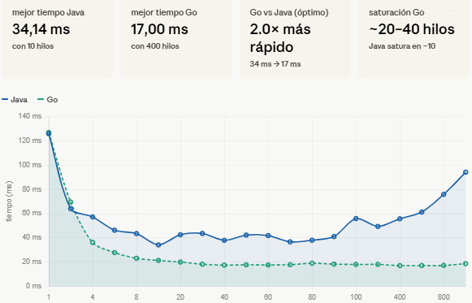

# Concurrent Counter: Java and Go Performance Comparison

## homework Description

This homework analyzes how dividing a counting task among multiple execution units affects performance. The same task was implemented in Java using threads and in Go using goroutines, using the same range from `1` to `500,000,000` in both cases.

---

# Part 1: Java Implementation

## Solution Approach

The program asks the user to enter the number of threads to use. Based on that input, it automatically divides the total range into equal parts and assigns each part to a thread. Each thread processes its assigned range independently and stores a partial result. At the end, the main program adds all partial results to get the final accumulated value.

Instead of printing every number, each thread just adds them up locally. This keeps the execution fast and makes the time measurement meaningful.

The time is measured only around the thread execution, not around the user input, so the results reflect only the actual computation.

---

## Java Test Results

| Threads | Time (ms) |
| ------: | --------: |
|       1 |    125.97 |
|       2 |     64.02 |
|       4 |     57.22 |
|       6 |     46.26 |
|       8 |     43.47 |
|      10 |     34.14 |
|      20 |     42.51 |
|      30 |     43.57 |
|      40 |     37.88 |
|      50 |     42.22 |
|      60 |     41.85 |
|      70 |     36.62 |
|      80 |     37.99 |
|      90 |     41.04 |
|     100 |     55.89 |
|     200 |     49.36 |
|     400 |     55.71 |
|     600 |     61.24 |
|     800 |     75.87 |
|    1000 |     94.17 |

---

## Java Results Analysis

The best result was `34.14 ms` with `10` threads. From `1` to `10` threads, performance improved consistently because the work was being divided among more cores and the processor could handle them all at the same time. The machine used for this test has `8` physical cores and `12` logical processors, so it makes sense that the sweet spot appeared around that number.

After `10` threads, performance stopped improving and started to fluctuate. The processor no longer had free cores to assign to each new thread, so the operating system had to start sharing CPU time among them. That switching between threads has a cost, and that cost begins to show up in the results.

With very high numbers like `600`, `800`, or `1000` threads, performance got noticeably worse. At `1000` threads the program took `94.17 ms`, which is almost three times slower than the best result. Creating and managing that many threads requires significant resources, and most of them end up waiting instead of doing useful work.

---

## Java Conclusions

Using threads improved performance, but only up to a point. The optimal number was `10` threads, close to the number of logical processors available. Beyond that, adding more threads introduced more overhead than benefit. The key takeaway is that more threads do not always mean faster execution.

---

# Part 2: Go Implementation

## Solution Approach

The Go version follows the same logic as Java. The user enters the number of goroutines, the range is divided equally among them, each goroutine processes its part independently, and the results are combined at the end.

The main difference is that goroutines are not operating system threads. They are managed by the Go runtime itself, which decides how to distribute them across the available CPU cores. This allows Go to run a large number of goroutines without the same overhead that Java experiences with OS threads.

The time is measured the same way as in Java, only around the actual computation, so the results are directly comparable.

---

## Go Test Results

| Goroutines | Time (ms) |
| ---------: | --------: |
|          1 |    126.94 |
|          2 |     69.51 |
|          4 |     36.16 |
|          6 |     27.77 |
|          8 |     23.06 |
|         10 |     21.28 |
|         20 |     19.94 |
|         30 |     18.18 |
|         40 |     17.39 |
|         50 |     17.66 |
|         60 |     17.53 |
|         70 |     17.79 |
|         80 |     18.97 |
|         90 |     18.27 |
|        100 |     17.98 |
|        200 |     18.03 |
|        400 |     17.00 |
|        600 |     17.06 |
|        800 |     17.16 |
|       1000 |     18.63 |

---

## Go Results Analysis

The best result was `17.00 ms` with `400` goroutines. From `1` to `40` goroutines, performance improved steadily, faster than Java did in the same range. Go was already at `36.16 ms` with just `4` goroutines, while Java was still at `57.22 ms` at that point.

What makes Go stand out is what happens after the optimal point. Unlike Java, performance did not degrade. From `40` to `1000` goroutines, the times stayed between `17` and `19` ms. The Go runtime is able to handle a large number of goroutines efficiently by managing them internally, without asking the operating system to switch between them constantly. That is why there is no significant overhead even at `1000` goroutines.

---

## Go Conclusions

Go reached a lower performance floor than Java and maintained it even at very high concurrency levels. The optimal range was wider, and there was no noticeable degradation when using hundreds of goroutines. This makes Go a more forgiving option when the number of concurrent execution units is not carefully tuned.

---

# Java vs Go Comparison

| Execution Units | Java (ms) | Go (ms) |
| --------------: | --------: | ------: |
|               1 |    125.97 |  126.94 |
|               2 |     64.02 |   69.51 |
|               4 |     57.22 |   36.16 |
|               6 |     46.26 |   27.77 |
|               8 |     43.47 |   23.06 |
|              10 |     34.14 |   21.28 |
|              20 |     42.51 |   19.94 |
|              30 |     43.57 |   18.18 |
|              40 |     37.88 |   17.39 |
|              50 |     42.22 |   17.66 |
|              60 |     41.85 |   17.53 |
|              70 |     36.62 |   17.79 |
|              80 |     37.99 |   18.97 |
|              90 |     41.04 |   18.27 |
|             100 |     55.89 |   17.98 |
|             200 |     49.36 |   18.03 |
|             400 |     55.71 |   17.00 |
|             600 |     61.24 |   17.06 |
|             800 |     75.87 |   17.16 |
|            1000 |     94.17 |   18.63 |

With `1` or `2` execution units both languages performed almost the same, which makes sense since the task itself is identical. The difference starts at `4` units and grows from there. Go's best time was `17.00 ms` versus Java's `34.14 ms`, roughly `2x` faster. At `1000` units the gap is even larger: Go finished in `18.63 ms` while Java took `94.17 ms`.

---

# General Conclusion

Both languages showed that dividing work among multiple execution units reduces execution time, but each has a different limit. Java performed best around `10` threads and degraded from there, reaching its worst time at `1000` threads. Go performed best around `40` goroutines and stayed stable all the way to `1000`, with almost no degradation.

The difference comes down to how each language handles concurrency under the hood. Java depends on the operating system to manage threads, which becomes expensive when there are many of them. Go manages its own execution units internally, which keeps the overhead low regardless of how many goroutines are running.

For a CPU-bound task like this one, Go was the faster and more stable option.

